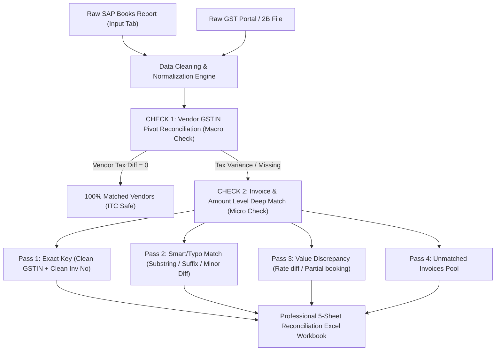

# 📊 Automated 2-Way GST Reconciliation Engine (Portal 2B vs SAP Books)

> **Developed for:** V. Singhi & Associates / `vsinghidelhi`  
> **Purpose:** 100% Automated Bi-Directional GST Reconciliation between GST Portal (GSTR-2B) and SAP Purchase Register (Books).

---

## 🎯 Core Concept & 2-Check Architecture

This reconciliation engine follows a **Macro-to-Micro 2-Check Architecture** to achieve maximum accuracy and zero false mismatches:



### 🔍 Check 1: Vendor GSTIN Pivot (Macro Level)
* Aggregates all transactions by **Supplier GSTIN**.
* Calculates Total Books Tax (IGST + CGST + SGST) vs Total Portal Tax (IGST + CGST + SGST).
* Groups vendors into 4 high-level categories:
  1. **100% Matched:** Vendor-level tax variance $\le ₹2.00$ (No further investigation needed).
  2. **Tax Variance:** Vendor exists on both sides, but total tax differs.
  3. **Only in Books:** Vendor billed in SAP, but filed ₹0 on GST Portal (Defaulting vendor / ITC risk).
  4. **Only in Portal:** Vendor filed on Portal, but entry not found in Books (Unclaimed ITC).

### 🔍 Check 2: Invoice & Amount Level Deep Match (Micro Level)
* **Invoice Normalization Rule:** Strips special characters (`/`, `-`, `_`, `.`, `\`, spaces) and removes leading zeros (`000456` $\rightarrow$ `456`).
* **Multi-Line Item Aggregation:** Combines multiple line items in SAP belonging to the same invoice before matching.
* **Smart / Typo Tolerance:** Automatically handles human typos (e.g. `0048` vs `004B`, `ECO/25-26/0258` vs duplicate pasted string, or date placed in doc number).

---

## 🔄 2-Way Bi-Directional Reconciliation Output

The generated Excel report provides complete two-way visibility:

| Tab Name | Purpose & Content | Recommended Action |
|:---|:---|:---|
| **`Dashboard & KPI Summary`** | Executive summary of Total Books Tax, Total Portal Tax, Reconciled Amount, and Net Variance. | Management review & audit record. |
| **`1_Vendor_Pivot_Check`** | Vendor-wise summary (GSTIN, Name, Books Tax, Portal Tax, Variance, Bill Counts, Status). | Bird's-eye view of vendor compliance. |
| **`2_Books_vs_Portal`** | Every single line from SAP Books with mapped Portal Doc No, Portal Tax, Difference, and Match Status. | Send GSTR-1 reminder / follow-up to vendors for missing entries. |
| **`3_Portal_vs_Books`** | Every single line from GST Portal with mapped SAP Bill No, SAP Tax, Difference, and Booking Status. | Forward unbooked bills to Accounts team to claim eligible ITC. |
| **`4_Actionable_Discrepancies`** | Filtered exception list (Missing in 2B + Missing in Books + Value Mismatches) with audit impact notes. | Direct working sheet for day-to-day resolution. |

---

## 🚀 How to Run

### 1. Prerequisites
Install `openpyxl`:
```bash
pip install -r requirements.txt
```

### 2. Run Reconciliation
```bash
python run_reconciliation.py
```

### 3. Customize File Paths or Branch
Open `run_reconciliation.py` and modify the default configuration:
```python
books_file = r"C:\path\to\Combined PR GST REPORT_Books.xlsx"
portal_file = r"C:\path\to\Bangalore IOT_GST portal.xlsx"
branch_name = "Bangalore IOT"  # Or set to None for all branches
output_report = r"C:\path\to\Reconciliation_Report.xlsx"
```

---

## 📁 Repository Structure

```
gst-reconciliation/
│
├── reconciler.py              # Core reconciliation logic & Excel styling engine
├── run_reconciliation.py      # Execution script with CLI summary
├── github_uploader.py         # Automated GitHub synchronization script
├── requirements.txt           # Python dependencies
├── .gitignore                 # Excludes raw client Excel sheets & cache
└── README.md                  # Comprehensive documentation
```

---

## 🛡️ Data Confidentiality & Security
Client data files (`*.xlsx`) are excluded in `.gitignore` to ensure financial reports are never uploaded to public version control.
